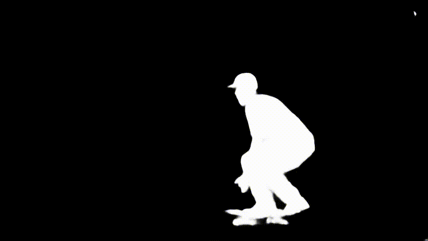

## Creative Video Processing with Object Segmentation and Style Transfer

The idea of this project is to segment a given object on the foreground of a video, and use the segmentation as a mask, in
order to produce a video where only the foreground has a different transfered style. This easily extends to having only the
background stylized, or having background and foreground with different styles. 

We perform semi-supervised video segmentation, given one or several already segmented frames of our video. The implementation relies on the Pytorch implementation of [_OSVOS: One-Shot Video Object Segmentation_](https://cvlsegmentation.github.io/osvos/#publication), available [here](https://github.com/kmaninis/OSVOS-PyTorch).  
We perform fast neural style transfer as seen in [_Perceptual Losses for Real-Time
Style Transfer and Super-Resolution_](https://arxiv.org/abs/1603.08155v1), and an implentation available [here](https://github.com/rrmina/fast-neural-style-pytorch). 

We proovide here an interactive notebook that can be used to apply this process to your own videos, and train style transfer networks on your own style images. 

## Demo

  

### OSVOS video segmentaiton

  

 +

 =

### Fast Neural Style Transfer

  

 +

 =

### Merging results

  

### Requirements:

Rq: A cuda capable device is required.  

1. Run environment_setup.sh to create a new conda environment and install necessary packages
2. Intall ffmpeg and add it to environment variables. See instructions [here](https://github.com/adaptlearning/adapt_authoring/wiki/Installing-FFmpeg)
3. Download the [parent model](https://data.vision.ee.ethz.ch/kmaninis/share/OSVOS/Downloads/models/pth_parent_model.zip) (55 MB), and unzip it under `OSVOS-Pytorch/models/`.
4. Download [Pre-trained VGG16 network weights](https://github.com/jcjohnson/pytorch-vgg) - and place it in fast-neural-style-pyton/models.
5. Download [MS-COCO Train Images (2014)](https://cocodataset.org/#download)  (13GB)  - and place unzipped train2014 directory in fast-neural-style-pyton/data/train2014
  Keeping only 2000 images of this data is enough

The notebook should be ready to run !

  
 

